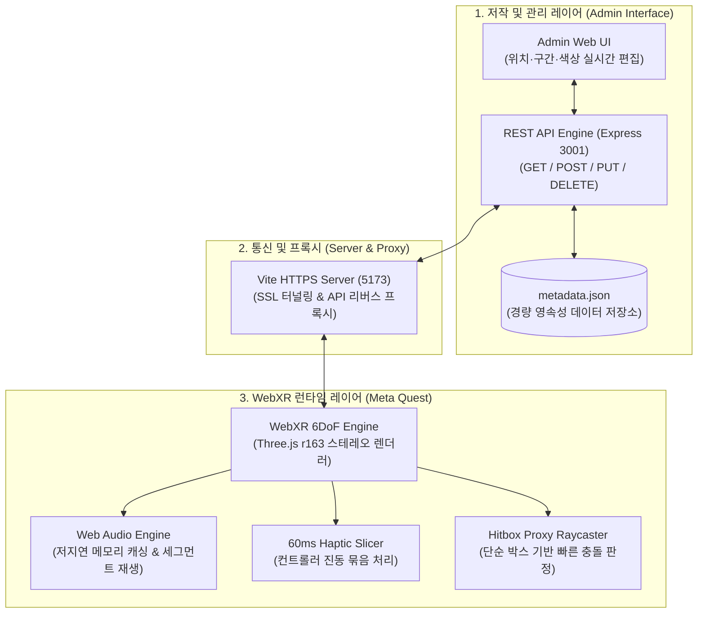

# WebXR 햅틱·오디오 메타데이터 저작 도구

> **WebXR 기반 3D 가상 공간에서 오브젝트에 연계된 햅틱 피드백 및 오디오 메타데이터를 직관적으로 저작하고 실시간으로 검증하는 풀스택 연구용 도구**  
> Three.js 및 Web Audio / WebXR Gamepad API를 기반으로, 외부 햅틱·사운드 에셋을 3D 오브젝트에 매핑하고 60ms 윈도우 슬라이싱과 프록시 히트박스를 통해 Meta Quest에서 안정적인 90fps 멀티모달 상호작용을 보장합니다.

[](https://nodejs.org/)
[](https://threejs.org/)
[](https://immersiveweb.dev/)
[](https://expressjs.com/)
[](https://vitejs.dev/)
[](LICENSE)

---

## 데모 미리보기

| 1. 메인 3D 가상 공간 화면 | 2. 메타데이터 관리자 UI (Admin) |
| :---: | :---: |
|  |  |
| **3. VR 컨트롤러 인터랙션 화면** | **4. 메타데이터 상세 편집 화면 (모달)** |
|  |  |

---

## 1. 프로젝트 개요

* **기술 스택**: 
  - **Frontend**: Three.js (r163), WebXR Device API, Web Audio API, Vite, `@vitejs/plugin-basic-ssl`
  - **Backend**: Node.js, Express.js (RESTful API Engine, 정적 에셋 서빙)
  - **Data Engine**: JSON 영속성 데이터베이스 (`metadata.json`)
  - **Target Device**: Meta Quest 2 / 3 / Pro (Oculus Browser), 데스크톱 브라우저 (Chrome/Edge)

---

## 2. 문제 의식

1. **소리와 진동을 3D 공간에 결합하고 검증하는 과정의 비효율**:
   - 3D 공간의 물체마다 사운드와 진동 피드백을 연결할 때, 외부 제작 툴(Haptics Studio 등)과 3D 뷰어 간의 시간 축이 달라 일일이 수작업으로 좌표를 맞추고 매번 코드를 다시 빌드해야 하는 번거로움이 큼.
2. **컨트롤러 진동 신호 씹힘(캔슬) 현상**:
   - 1밀리초(ms) 단위의 촘촘한 고주파 진동 데이터를 VR 컨트롤러에 그대로 연속 전달하면, 기기 모터가 신호 속도를 따라가지 못해 이전 진동이 끊기거나 타이밍이 뒤로 밀리는 문제 발생.
3. **정밀한 3D 모델 조준 시 프레임 저하**:
   - 수십만 개의 삼각형 면으로 이루어진 고해상도 3D 모델(60MB 이상)을 배치할 경우, 컨트롤러 포인터로 겨눌 때마다 수만 개의 면을 일일이 검사하느라 VR 프레임(90fps)이 크게 떨어짐.

---

## 3. 시스템 아키텍처



---

## 4. 핵심 트러블슈팅 및 기술적 해결

### 1) 60ms 묶음 전송(슬라이싱)으로 컨트롤러 진동 끊김 해결
* **문제 현상**:
  - 외부 툴에서 추출한 1ms 단위의 미세한 진동 데이터를 브라우저 진동 API로 계속해서 쏘아 보내면, 컨트롤러 내부 모터가 반응 속도를 감당하지 못해 진동이 뚝뚝 끊기거나 뒤늦게 울리는 현상 발생.
* **해결 방법**:
  - 컨트롤러 모터가 안정적으로 구동할 수 있는 주기인 **60ms 단위 묶음**으로 데이터를 나누어 전달.
  - 60ms 동안의 평균 진동 세기를 계산해 한 번의 깔끔한 진동 펄스로 압축하여, 모터에 무리를 주지 않으면서도 원본 진동의 강약과 질감을 부드럽게 재현.

### 2) 단순 박스형 히트박스(Hitbox Proxy)로 90 FPS 방어
* **문제 현상**:
  - 고해상도 차량 모델(수십만 개 면)에 레이저 포인터를 겨눌 때마다 모델의 모든 면과 꼭짓점을 일일이 충돌 검사하여 프레임이 45fps 이하로 급락.
* **해결 방법**:
  - 복잡한 차량 표면을 직접 검사하지 않고, 차량 외곽 크기에 딱 맞춘 **투명한 단순 직육면체 박스**를 대신 생성.
  - 레이저 조준 대상을 이 투명 박스 1개로 제한하여 수만 번의 충돌 계산을 단 1번의 판정으로 줄임으로써, Quest 단말에서 안정적인 90 FPS를 방어.

### 3) VR 접속 환경을 위한 통합 네트워크(프록시) 구성
* **문제 현상**:
  - VR 헤드셋 실행에 필수적인 보안 프로토콜(HTTPS 5173)과 일반 데이터 서버(HTTP 3001)가 서로 프로토콜이 달라, 브라우저 보안 차단(Mixed Content / CORS)으로 데이터를 주고받지 못하는 문제 발생.
* **해결 방법**:
  - 프론트엔드 서버에 내부 중계(프록시) 경로를 설정하여, 모든 데이터 통신이 단일 HTTPS 주소 안에서 안전하게 오가도록 일원화.
  - PC의 로컬 네트워크 IP를 자동으로 감지해 터미널에 띄워줌으로써, 헤드셋 브라우저에서 복잡한 설정 없이 주소 하나로 뷰어와 관리자 기능을 한 번에 연결.

---

## 5. 빠른 시작

### 사전 요구사항
* [Node.js](https://nodejs.org/) v20.0.0 이상
* [Git LFS](https://git-lfs.com/) (대용량 3D 에셋 클론 시 필수)

### 1) 저장소 클론 및 패키지 설치
```bash
# Git LFS 활성화 (대용량 3D 에셋 다운로드)
git lfs install

# 저장소 클론
git clone https://github.com/kimhohyeon0324/XR_MetaData.git
cd XR_MetaData

# 의존성 설치
npm install
```

### 2) 개발 서버 실행
```bash
npm run dev
```
> `npm run dev` 실행 시 백엔드 API 서버(포트 3001)와 Vite 프론트엔드 서버(포트 5173)가 동시에 실행되며, 현재 PC의 실제 네트워크 IP가 콘솔에 자동 출력됩니다.

* **PC 3D 뷰어**: `https://localhost:5173/`
* **관리자 페이지 (Admin UI)**: `https://localhost:5173/admin`
* **REST API 엔드포인트**: `http://localhost:3001/api/metadata`

---

## 6. Meta Quest 접속 가이드

1. **동일한 로컬 네트워크(Wi-Fi) 연결**:
   - 서버를 구동 중인 PC와 Meta Quest 헤드셋이 **반드시 같은 공유기(Wi-Fi)**에 연결되어 있어야 합니다.
2. **Quest 브라우저에서 접속**:
   - 헤드셋을 착용하고 오큘러스 브라우저 주소창에 터미널에 출력된 IP 주소를 입력합니다:
     ```
     https://<PC_로컬_IP>:5173
     ```
3. **자체 서명 SSL 인증서 승인 (최초 1회 필수)**:
   - 첫 접속 시 *"연결이 비공개로 설정되어 있지 않습니다"* 경고가 표시될 경우, 화면 하단의 **[고급(Advanced)]** 클릭 후 **[<PC_IP> (안전하지 않음)으로 이동]**을 선택하여 승인합니다.
4. **VR 진입**:
   - 화면 중앙 하단의 **`ENTER VR`** 버튼을 클릭하여 몰입형 3D 인터랙션 세션으로 진입합니다.

---

## 7. 외부 에셋 라이선스

프로젝트에 활용된 외부 3D 에셋은 해당 라이선스 규정을 준수하여 사용되었습니다:

* **1972 Datsun 240K GT 3D Model**:
  - **저작자**: Karol Miklas ([Sketchfab Profile](https://sketchfab.com/karolmiklas))
  - **출처**: [(FREE) 1972 Datsun 240k GT on Sketchfab](https://sketchfab.com/3d-models/free-1972-datsun-240k-gt-b2303a552b444e5b8637fdf5169b41cb)
  - **라이선스**: [CC-BY-SA 4.0 (Creative Commons Attribution-ShareAlike 4.0 International)](http://creativecommons.org/licenses/by-sa/4.0/)

---

## Author & Contact

* **개발자**: 김호현
* **GitHub**: [kimhohyeon0324](https://github.com/kimhohyeon0324)
* **저장소 링크**: [XR_MetaData](https://github.com/kimhohyeon0324/XR_MetaData)
* **License**: MIT

