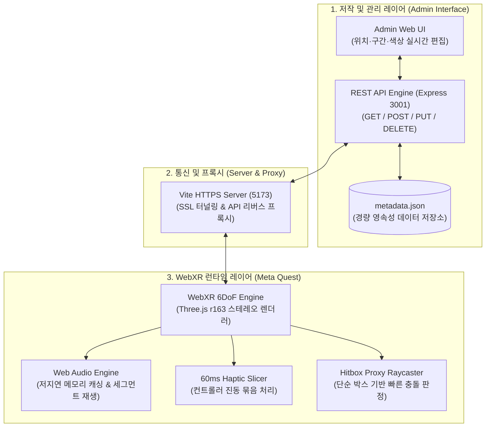

# XR_MetaData: WebXR 햅틱·오디오 메타데이터 저작 도구

> **WebXR 기반 3D 가상 공간에서 오브젝트에 연계된 햅틱 피드백 및 오디오 메타데이터를 직관적으로 저작하고 실시간으로 검증하는 풀스택 연구용 도구**  
> Three.js 및 Web Audio / WebXR Gamepad API를 기반으로, 외부 햅틱·사운드 에셋을 3D 오브젝트에 매핑하고 60ms 윈도우 슬라이싱과 프록시 히트박스를 통해 Meta Quest에서 안정적인 90fps 멀티모달 상호작용을 보장합니다.

[](https://nodejs.org/)
[](https://threejs.org/)
[](https://immersiveweb.dev/)
[](https://expressjs.com/)
[](https://vitejs.dev/)
[](LICENSE)

---

## 데모 미리보기

| 1. 메인 3D 가상 공간 화면 | 2. 메타데이터 관리자 UI (Admin) |
| :---: | :---: |
|  |  |
| **3. VR 컨트롤러 인터랙션 화면** | **4. 메타데이터 상세 편집 화면 (모달)** |
|  |  |

---

## 1. 프로젝트 개요

* **기술 스택**: 
  - **Frontend**: Three.js (r163), WebXR Device API, Web Audio API, Vite, `@vitejs/plugin-basic-ssl`
  - **Backend**: Node.js, Express.js (RESTful API Engine, 정적 에셋 서빙)
  - **Data Engine**: JSON 영속성 데이터베이스 (`metadata.json`)
  - **Target Device**: Meta Quest 2 / 3 / Pro (Oculus Browser), 데스크톱 브라우저 (Chrome/Edge)

---

## 2. 문제 의식

1. **네이티브(Unity/APK) 빌드 및 배포 반복에 따른 연구 검증 오버헤드**:
   - 기존 XR 환경에서는 3D 오브젝트에 사운드와 진동(햅틱) 효과를 결합하고 테스트할 때마다 APK 빌드와 헤드셋 재설치(수 분 이상 소요)를 끝없이 반복해야 하는 극심한 시간적 비용이 발생했습니다.
2. **사운드·진동·3D 공간 저작 도구의 분절과 싱크 조율의 한계**:
   - 오디오 믹싱 툴(DAW), 진동 파형 에디터(Haptics Studio), 3D 모델링 툴이 제각각 분리되어 있어, 가상 공간 안에서 시각-청각-촉각의 정밀한 타이밍과 위치 좌표를 한눈에 보며 실시간으로 조율하기가 불가능했습니다.
   - 따라서 **"별도의 앱 설치나 재빌드 없이 웹 브라우저에서 3D 오브젝트별 햅틱·오디오 메타데이터를 즉시 저작·수정하고, Meta Quest HMD에서 실시간 6DoF로 즉각 체감·검증할 수 있는 통합 웹XR 저작 도구"**를 구축하고자 본 프로젝트를 시작했습니다.

---

## 3. 시스템 아키텍처



---

## 4. 핵심 트러블슈팅 및 기술적 해결

### 1) 60ms 묶음 전송(슬라이싱)으로 컨트롤러 진동 누락 및 모터 부하 해결
* **문제 현상**:
  - 외부 햅틱 에디터에서 추출한 1ms 단위 고주파 진동 데이터를 WebXR Gamepad API(`pulse()`)로 연속 호출하면, 브라우저 메인 루프 지연 및 컨트롤러 내부 액추에이터의 펄스 중첩으로 인해 진동이 뚝뚝 끊기거나 뒤로 밀리는 캔슬 현상 발생.
* **해결 방법**:
  - 하드웨어 액추에이터의 물리적 응답 지연(Rise/Fall Time 약 30~50ms)과 WebXR Gamepad API 특성을 고려하여, 펄스 중첩 없이 안정적으로 연속 진동을 표현할 수 있는 **60ms 윈도우 슬라이싱** 기법을 적용.
  - 슬라이스 윈도우 내 평균 진동 강도를 산출하고 단일 펄스로 압축 전달하여, 기기 부하를 원천 차단하면서도 원본 햅틱의 세밀한 질감과 강약을 부드럽게 재현.

### 2) 단순 박스형 히트박스(Hitbox Proxy)로 90 FPS 레이캐스팅 방어
* **문제 현상**:
  - 수십만 개 폴리곤의 고해상도 차량 모델(60MB+)에 대해 VR 컨트롤러 레이저 포인터가 매 프레임(90Hz) 광선-삼각형(Ray-Triangle) 교차 검사를 수행하면서 심각한 CPU 병목과 함께 45 FPS 이하로 프레임 급락.
* **해결 방법**:
  - 복잡한 차량 원본 메쉬 대신, 차량 외곽 바운딩 크기에 맞춘 경량 **투명 박스(Hitbox Proxy)**를 생성하여 씬에 배치.
  - 레이캐스터 충돌 판정 대상을 이 투명 박스 1개로 제한하여 충돌 검사 비용을 $O(N)$에서 $O(1)$로 단축, 고해상도 모델 환경에서도 안정적인 90 FPS 상호작용을 보장.

---

## 5. 조작 가이드

### 데스크톱 웹 환경
| 입력 | 동작 |
| :--- | :--- |
| **마우스 좌클릭 (3D 오브젝트 조준)** | 해당 오브젝트 선택, 오디오 재생 및 3D 정보창 표시 |
| **마우스 좌클릭 드래그** | 씬 360° 궤도 회전 |
| **마우스 우클릭 드래그** | 카메라 시점 이동 |
| **마우스 휠 스크롤** | 카메라 확대 / 축소 |
| **관리자 페이지 접속 (`/admin`)** | 3D 오브젝트 등록, 위치 좌표(X/Y/Z) 및 햅틱 재생 구간 실시간 편집 |

### Meta Quest 환경
| 컨트롤러 입력 | 동작 |
| :--- | :--- |
| **컨트롤러 레이저 포인팅** | 3D 오브젝트 겨냥 (타깃 커서 가이드 표시) |
| **컨트롤러 트리거 클릭** | 오브젝트 선택 및 인터랙션 실행 (소리 재생 + 60ms 햅틱 진동 피드백) |

---

## 6. 빠른 시작

### 사전 요구사항
* [Node.js](https://nodejs.org/) v20.0.0 이상
* [Git LFS](https://git-lfs.com/) (대용량 3D 에셋 클론 시 필수)

### 1) 저장소 클론 및 패키지 설치
```bash
# Git LFS 활성화 (대용량 3D 에셋 다운로드)
git lfs install

# 저장소 클론
git clone https://github.com/kimhohyeon0324/XR_MetaData.git
cd XR_MetaData

# 의존성 설치
npm install
```

### 2) 개발 서버 실행
```bash
npm run dev
```
> `npm run dev` 실행 시 백엔드 API 서버(포트 3001)와 Vite 프론트엔드 서버(포트 5173)가 동시에 실행되며, 현재 PC의 실제 네트워크 IP가 콘솔에 자동 출력됩니다.

* **PC 3D 뷰어**: `https://localhost:5173/`
* **관리자 페이지 (Admin UI)**: `https://localhost:5173/admin`
* **REST API 엔드포인트**: `http://localhost:3001/api/metadata`

---

## 7. Meta Quest 접속 가이드

1. **동일한 로컬 네트워크(Wi-Fi) 연결**:
   - 서버를 구동 중인 PC와 Meta Quest 헤드셋이 **반드시 같은 공유기(Wi-Fi)**에 연결되어 있어야 합니다.
2. **Quest 브라우저에서 접속**:
   - 헤드셋을 착용하고 오큘러스 브라우저 주소창에 터미널에 출력된 IP 주소를 입력합니다:
     ```
     https://<PC_로컬_IP>:5173
     ```
3. **자체 서명 SSL 인증서 승인 (최초 1회 필수)**:
   - 첫 접속 시 *"연결이 비공개로 설정되어 있지 않습니다"* 경고가 표시될 경우, 화면 하단의 **[고급(Advanced)]** 클릭 후 **[<PC_IP> (안전하지 않음)으로 이동]**을 선택하여 승인합니다.
4. **VR 진입**:
   - 화면 중앙 하단의 **`ENTER VR`** 버튼을 클릭하여 몰입형 3D 인터랙션 세션으로 진입합니다.

---

## 8. 외부 에셋 라이선스

프로젝트에 활용된 외부 3D 에셋은 해당 라이선스 규정을 준수하여 사용되었습니다:

* **1972 Datsun 240K GT 3D Model**:
  - **저작자**: Karol Miklas ([Sketchfab Profile](https://sketchfab.com/karolmiklas))
  - **출처**: [(FREE) 1972 Datsun 240k GT on Sketchfab](https://sketchfab.com/3d-models/free-1972-datsun-240k-gt-b2303a552b444e5b8637fdf5169b41cb)
  - **라이선스**: [CC-BY-SA 4.0 (Creative Commons Attribution-ShareAlike 4.0 International)](http://creativecommons.org/licenses/by-sa/4.0/)

---

## 라이선스

본 프로젝트의 소스코드는 [MIT License](LICENSE)를 따릅니다.


