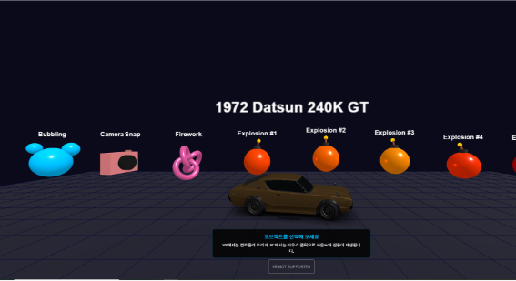
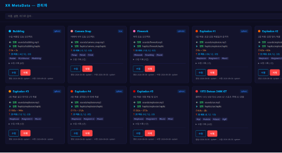
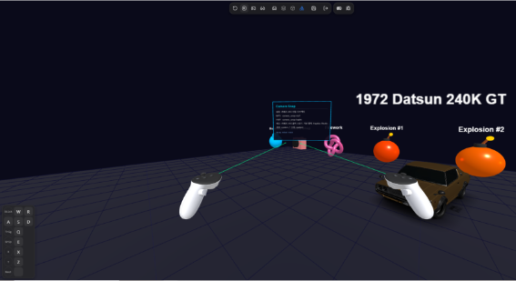
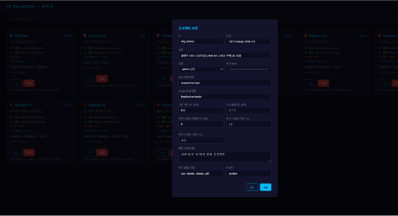

# WebXR 햅틱·오디오 메타데이터 저작 도구

> **WebXR 기반 3D 가상 공간에서 오브젝트에 연계된 햅틱 피드백 및 오디오 메타데이터를 직관적으로 저작하고 실시간으로 검증하는 풀스택 연구용 도구**

[](https://nodejs.org/)
[](https://threejs.org/)
[](https://immersiveweb.dev/)
[](LICENSE)

---

## 프로젝트 소개

**XR MetaData**는 3D 가상 공간 내 오브젝트에 오디오 및 햅틱 에셋을 연동하고, 상호작용 파라미터를 관리·검증하기 위한 WebXR 기반 연구용 메타데이터 저작 도구입니다.

Haptics Studio 등 외부 도구에서 사전 제작된 오디오(MP3) 및 햅틱(.haptic) 파일을 3D 오브젝트에 매핑하고, 관리자 웹 인터페이스(Admin UI)를 통해 재생 구간(`segmentStart` ~ `segmentEnd`)과 3D 위치 좌표를 손쉽게 편집할 수 있습니다.

저작된 결과는 Meta Quest VR 환경에서 컨트롤러 인터랙션을 통해 별도의 빌드 과정 없이 실시간으로 테스트할 수 있어, 햅틱 멀티모달 콘텐츠 연구 및 실험 데이터 수집에 필요한 반복 검증 시간을 대폭 단축합니다.

---

## 데모 미리보기

| 1. 메인 3D 가상 공간 화면 | 2. 메타데이터 관리자 UI (Admin) |
| :---: | :---: |
|  |  |
| **3. VR 컨트롤러 인터랙션 화면** | **4. 메타데이터 상세 편집 화면 (모달)** |
|  |  |

---

## 주요 기능

### 1. WebXR 몰입형 인터랙션 환경
* **Meta Quest 최적화**: 6DoF 헤드 트래킹 및 컨트롤러 레이저 포인팅, 타깃 커서 지원
* **시각 피드백**: 오브젝트 조준(Hover) 및 선택 시 발광(Emissive) 플래시 (250ms 자동 복원)
* **VR 3D 정보창**: 오브젝트 선택 시 VR 공간 내 실시간 메타데이터 패널(Sprite Canvas) 표시

### 2. 오디오-햅틱 멀티모달 피드백 연동
* **통합 타임라인 매핑**: 오브젝트마다 사운드와 진동의 재생 구간(`segmentStart` ~ `segmentEnd`)을 일치시켜 동시 출력
* **60ms 윈도우 슬라이싱 (햅틱 모터 최적화)**: 1ms 단위의 고주파 진동 파형을 컨트롤러 LRA 모터가 인식할 수 있는 60ms 청크로 변환하여 신호 캔슬(Canceling) 현상 방지
* **저지연 오디오 재생**: Web Audio API 기반의 밀리초 단위 세그먼트 재생 및 메모리 사전 캐싱(`preloadAudio`) 적용

### 3. 웹 기반 메타데이터 관리 시스템 (Admin UI)
* **REST API 기반 CRUD**: 오브젝트 생성, 조회, 수정, 삭제 엔드포인트 지원 (`GET`, `POST`, `PUT`, `DELETE`)
* **직관적인 파라미터 편집**: 3D 위치 좌표(X, Y, Z), 색상, 파일 경로, 햅틱 구간을 브라우저에서 실시간 편집

### 4. 외부 고폴리곤 3D 에셋(GLTF 2.0) 지원
* **자동 스케일 및 중심점 정규화**: 바운딩 박스(`THREE.Box3`) 기반으로 수 미터 단위의 3D 모델을 전시대 비율(1.0m)로 자동 보정
* **히트박스 분리 최적화**: 수십만 폴리곤 모델의 메쉬 순회를 방지하고, 전용 직육면체 히트박스(`BoxGeometry`)만을 레이캐스팅하여 90fps 프레임 드랍 원천 차단

---

## 시스템 아키텍처

```
[ 관리자 (Admin UI) ] ──(REST API)──> [ Express 백엔드 서버 (3001) ] ──> [ metadata.json ]
                                             ↕ (Proxy)
[ Meta Quest (WebXR) ] ──(HTTPS)────> [ Vite 프론트엔드 서버 (5173) ]
```

* **Frontend**: Three.js (r163), WebXR Device API, Vite (`@vitejs/plugin-basic-ssl`)
* **Backend**: Node.js, Express.js (REST API, 정적 파일 서빙)
* **Data**: JSON 기반 경량 메타데이터 저장소 (`metadata.json`)

---

## 빠른 시작 (Getting Started)

### 사전 요구사항
* [Node.js](https://nodejs.org/) v20.0.0 이상
* [Git LFS](https://git-lfs.com/) (대용량 3D 에셋 클론 시 권장)

### 1. 저장소 클론 및 패키지 설치
```bash
# Git LFS 활성화 (대용량 3D 에셋 다운로드)
git lfs install

# 저장소 클론
git clone https://github.com/kimhohyeon0324/XR_MetaData.git
cd XR_MetaData

# 의존성 설치
npm install
```

### 2. 로컬 개발 서버 실행
```bash
npm run dev
```
> `npm run dev` 실행 시 백엔드 API 서버(포트 3001)와 Vite 프론트엔드 서버(포트 5173)가 동시에 실행되며, 현재 PC의 실제 네트워크 IP가 콘솔에 자동 출력됩니다.

* **PC 3D 뷰어**: `https://localhost:5173/`
* **관리자 페이지 (Admin UI)**: `https://localhost:5173/admin`
* **REST API 엔드포인트**: `http://localhost:3001/api/metadata`

---

## Meta Quest 접속 가이드

WebXR 환경을 Meta Quest 2 / 3에서 정상적으로 구동하려면 아래 보안 및 네트워크 조건을 확인해야 합니다.

1. **동일한 로컬 네트워크(Wi-Fi) 연결**:
   * 서버를 구동 중인 PC와 Meta Quest 헤드셋이 **반드시 같은 공유기(Wi-Fi)**에 연결되어 있어야 합니다.
2. **Quest 브라우저에서 접속**:
   * 헤드셋을 착용하고 Quest 기본 브라우저 URL 주소창에 터미널에 표시된 IP 주소를 입력합니다:
     ```
     https://<PC_로컬_IP>:5173
     ```
3. **자체 서명 SSL 인증서 승인 (최초 1회 필수)**:
   * WebXR은 브라우저 보안 규정상 **HTTPS 보안 컨텍스트(Secure Context)**가 필수입니다.
   * 자체 서명 인증서 사용으로 인해 첫 접속 시 *"연결이 비공개로 설정되어 있지 않습니다"* 경고가 표시될 수 있습니다.
   * 화면 하단의 **[고급(Advanced)]** 버튼 클릭 후 **[<PC_IP> (안전하지 않음)으로 이동]**을 선택하여 승인합니다.
4. **VR 진입**:
   * 화면 중앙 하단의 **`ENTER VR`** 버튼을 클릭하여 몰입형 3D 인터랙션 세션으로 진입합니다.

---

## 대용량 3D 파일 관리 (Git LFS)

본 프로젝트에는 외부 고해상도 차량 모델(`free_1972_datsun_240k_gt/scene.bin`, 약 62.5MB)이 포함되어 있습니다.

* 저장소 루트의 [`.gitattributes`](.gitattributes)에 `*.bin`, `*.glb`, `*.fbx` 파일에 대한 **Git LFS** 설정이 적용되어 있습니다.
* GitHub에 푸시하거나 클론할 때 저장소 용량 과부하를 방지하기 위해 Git LFS 사용을 권장합니다.

---

## 외부 에셋 라이선스 (Third-Party Credits)

프로젝트에 활용된 외부 3D 에셋은 해당 라이선스 규정을 준수하여 사용되었습니다:

* **1972 Datsun 240K GT 3D Model**:
  * **저작자**: Karol Miklas ([Sketchfab Profile](https://sketchfab.com/karolmiklas))
  * **출처**: [(FREE) 1972 Datsun 240k GT on Sketchfab](https://sketchfab.com/3d-models/free-1972-datsun-240k-gt-b2303a552b444e5b8637fdf5169b41cb)
  * **라이선스**: [CC-BY-SA 4.0 (Creative Commons Attribution-ShareAlike 4.0 International)](http://creativecommons.org/licenses/by-sa/4.0/)

---

## 라이선스

본 프로젝트의 소스코드는 MIT License를 따릅니다.
