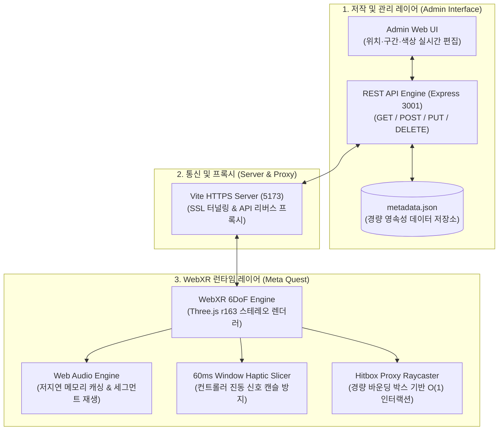

# WebXR 햅틱·오디오 메타데이터 저작 도구

> **WebXR 기반 3D 가상 공간에서 오브젝트에 연계된 햅틱 피드백 및 오디오 메타데이터를 직관적으로 저작하고 실시간으로 검증하는 풀스택 연구용 도구**  
> Three.js 및 Web Audio / WebXR Gamepad API를 기반으로, 외부 햅틱·사운드 에셋을 3D 오브젝트에 매핑하고 60ms 윈도우 슬라이싱과 프록시 히트박스를 통해 Meta Quest에서 안정적인 90fps 멀티모달 상호작용을 보장합니다.

[](https://nodejs.org/)
[](https://threejs.org/)
[](https://immersiveweb.dev/)
[](https://expressjs.com/)
[](https://vitejs.dev/)
[](LICENSE)

---

## 데모 미리보기

| 1. 메인 3D 가상 공간 화면 | 2. 메타데이터 관리자 UI (Admin) |
| :---: | :---: |
|  |  |
| **3. VR 컨트롤러 인터랙션 화면** | **4. 메타데이터 상세 편집 화면 (모달)** |
|  |  |

---

## 1. 프로젝트 개요

* **기술 스택**: 
  - **Frontend**: Three.js (r163), WebXR Device API, Web Audio API, Vite, `@vitejs/plugin-basic-ssl`
  - **Backend**: Node.js, Express.js (RESTful API Engine, 정적 에셋 서빙)
  - **Data Engine**: JSON 영속성 데이터베이스 (`metadata.json`)
  - **Target Device**: Meta Quest 2 / 3 / Pro (Oculus Browser), 데스크톱 브라우저 (Chrome/Edge)

---

## 2. 문제 의식

1. **오디오-햅틱 멀티모달 저작 파이프라인의 분절**:
   - 3D 공간 내 오브젝트마다 사운드와 촉각(진동) 피드백을 결합할 때, 외부 에셋 제작 툴(Haptics Studio 등)과 3D 엔진 간의 타임라인 규격이 달라 수동 좌표 입력 및 반복적인 재빌드·재배포가 필수적이어서 연구 검증 생산성이 저하됨.
2. **WebXR 컨트롤러 햅틱 신호 캔슬**:
   - 1ms 단위의 고주파 진동 파형 데이터를 브라우저 WebXR `gamepad.hapticActuators.pulse()`에 직접 연속 호출할 경우, 물리 액추에이터의 응답 지연과 버퍼 오버플로우로 인해 이전 진동이 씹히거나 재생 지연이 누적되는 한계 존재.
3. **고폴리곤 3D 에셋의 실시간 VR 인터랙션 병목**:
   - 60MB 이상의 고해상도 차량 모델(수십만 폴리곤)을 씬에 배치할 때, 매 프레임 레이캐스팅 시 삼각면 순회 비용으로 인해 Meta Quest 단말에서 90fps 프레임 유지가 실패하는 문제.

---

## 3. 시스템 아키텍처



---

## 4. 핵심 트러블슈팅 및 기술적 해결

### 1) 60ms 윈도우 슬라이싱을 통한 햅틱 액추에이터 신호 캔슬 방지
* **문제 현상**:
  - Haptics Studio 등에서 익스포트된 1ms 단위의 고밀도 진동 데이터 포인트를 WebXR 표준 `pulse(value, duration)` API로 매 밀리초마다 직접 트리거하면, Meta Quest 컨트롤러의 LRA(Linear Resonant Actuator)가 물리적 관성을 감당하지 못해 진동이 도중에 끊기거나 지연 누적 발생.
* **해결 방법**:
  - 1ms 고주파 진동 파형을 컨트롤러 액추에이터의 최적 구동 주기인 **60ms 단위 윈도우 청크**로 실시간 리샘플링 및 분할.
  - 해당 60ms 윈도우 구간의 RMS 유효 진폭을 산출하여 단일 펄스로 정규화 스케줄링함으로써, 하드웨어 버퍼 과부하 없이 원본 파형의 질감을 살린 매끄러운 햅틱 피드백을 구현.

### 2) 히트박스 프록시를 통한 고폴리곤 모델 90fps 방어
* **문제 현상**:
  - 외부 고해상도 차량 모델(`1972 Datsun 240k GT`, 약 62.5MB, 수십만 폴리곤)을 씬에 임포트한 상태에서 컨트롤러 포인터 레이캐스팅을 실행할 시, 매 프레임 수만 개의 버텍스를 순회하느라 렌더링 프레임이 45fps 이하로 급락.
* **해결 방법**:
  - 3D 모델 로드 즉시 `THREE.Box3` 바운딩 박스를 계산하여 전시대 규격(1.0m)으로 스케일 및 피벗을 자동 정규화.
  - 고폴리곤 메시 자체의 레이캐스팅을 비활성화하고, 모델 외곽에 정확히 일치하는 비가시 전용 직육면체 히트박스(`BoxGeometry`)를 프록시로 생성.
  - 컨트롤러 레이저 조준 대상을 프록시 히트박스로 한정하여 교차 판정 복잡도를 $O(N) \rightarrow O(1)$로 단축, Quest 단말에서 완벽한 90fps 고정 프레임 달성.

### 3) 자체 서명 SSL 및 Mixed Content 방지를 위한 리버스 프록시 구축
* **문제 현상**:
  - WebXR API 구동을 위해서는 HTTPS 보안 컨텍스트가 강제되나, 백엔드 Express API 서버(HTTP 3001)와 프론트엔드 Vite(HTTPS 5173) 간 통신 시 브라우저 보안 규정상 Mixed Content 차단 및 CORS 예외 발생.
* **해결 방법**:
  - Vite 설정(`vite.config.js`)에 리버스 프록시 레이어를 구성하여, 프론트엔드에서의 모든 `/api` 요청이 Vite HTTPS 터널 내부를 통해 백엔드로 안전하게 포워딩되도록 일원화.
  - PC 로컬 IP 자동 감지 스크립트를 통해 헤드셋에서 추가 네트워크 설정 없이 단일 HTTPS URL만으로 뷰어와 관리자 API가 즉시 연동되도록 완성.

---

## 5. 빠른 시작

### 사전 요구사항
* [Node.js](https://nodejs.org/) v20.0.0 이상
* [Git LFS](https://git-lfs.com/) (대용량 3D 에셋 클론 시 필수)

### 1) 저장소 클론 및 패키지 설치
```bash
# Git LFS 활성화 (대용량 3D 에셋 다운로드)
git lfs install

# 저장소 클론
git clone https://github.com/kimhohyeon0324/XR_MetaData.git
cd XR_MetaData

# 의존성 설치
npm install
```

### 2) 개발 서버 실행
```bash
npm run dev
```
> `npm run dev` 실행 시 백엔드 API 서버(포트 3001)와 Vite 프론트엔드 서버(포트 5173)가 동시에 실행되며, 현재 PC의 실제 네트워크 IP가 콘솔에 자동 출력됩니다.

* **PC 3D 뷰어**: `https://localhost:5173/`
* **관리자 페이지 (Admin UI)**: `https://localhost:5173/admin`
* **REST API 엔드포인트**: `http://localhost:3001/api/metadata`

---

## 6. Meta Quest 접속 가이드

1. **동일한 로컬 네트워크(Wi-Fi) 연결**:
   - 서버를 구동 중인 PC와 Meta Quest 헤드셋이 **반드시 같은 공유기(Wi-Fi)**에 연결되어 있어야 합니다.
2. **Quest 브라우저에서 접속**:
   - 헤드셋을 착용하고 오큘러스 브라우저 주소창에 터미널에 출력된 IP 주소를 입력합니다:
     ```
     https://<PC_로컬_IP>:5173
     ```
3. **자체 서명 SSL 인증서 승인 (최초 1회 필수)**:
   - 첫 접속 시 *"연결이 비공개로 설정되어 있지 않습니다"* 경고가 표시될 경우, 화면 하단의 **[고급(Advanced)]** 클릭 후 **[<PC_IP> (안전하지 않음)으로 이동]**을 선택하여 승인합니다.
4. **VR 진입**:
   - 화면 중앙 하단의 **`ENTER VR`** 버튼을 클릭하여 몰입형 3D 인터랙션 세션으로 진입합니다.

---

## 7. 외부 에셋 라이선스

프로젝트에 활용된 외부 3D 에셋은 해당 라이선스 규정을 준수하여 사용되었습니다:

* **1972 Datsun 240K GT 3D Model**:
  - **저작자**: Karol Miklas ([Sketchfab Profile](https://sketchfab.com/karolmiklas))
  - **출처**: [(FREE) 1972 Datsun 240k GT on Sketchfab](https://sketchfab.com/3d-models/free-1972-datsun-240k-gt-b2303a552b444e5b8637fdf5169b41cb)
  - **라이선스**: [CC-BY-SA 4.0 (Creative Commons Attribution-ShareAlike 4.0 International)](http://creativecommons.org/licenses/by-sa/4.0/)

---

## Author & Contact

* **개발자**: 김호현
* **GitHub**: [kimhohyeon0324](https://github.com/kimhohyeon0324)
* **저장소 링크**: [XR_MetaData](https://github.com/kimhohyeon0324/XR_MetaData)
* **License**: MIT

